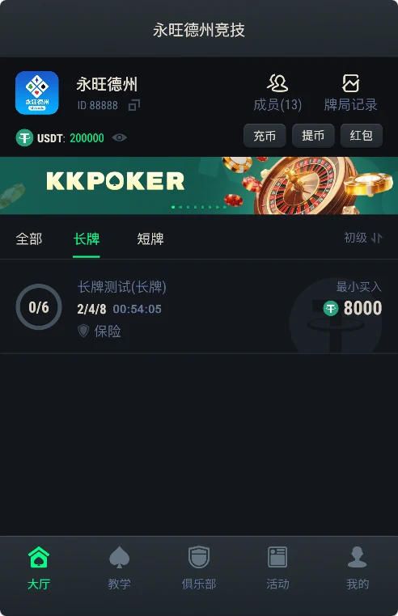
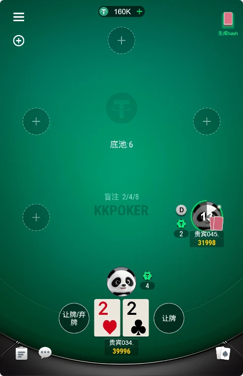
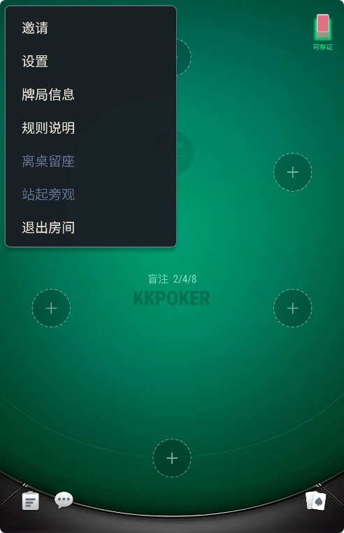
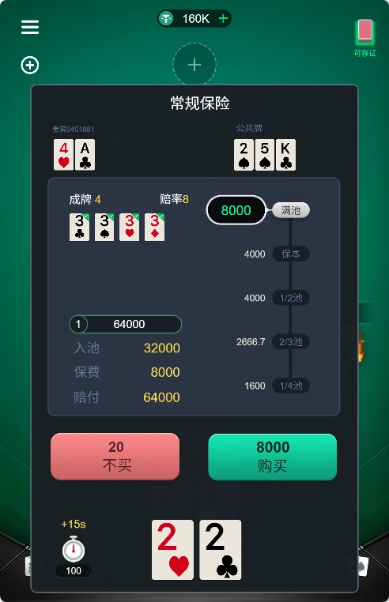
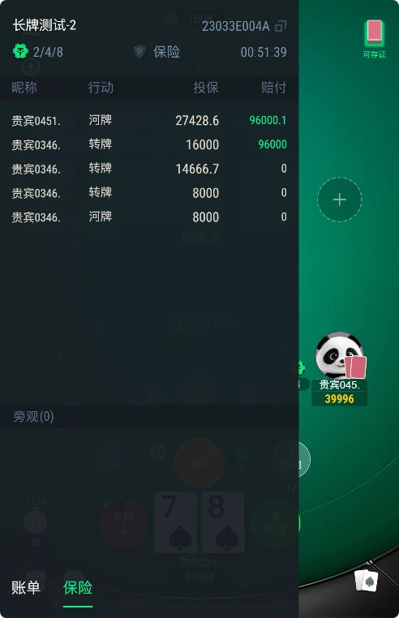
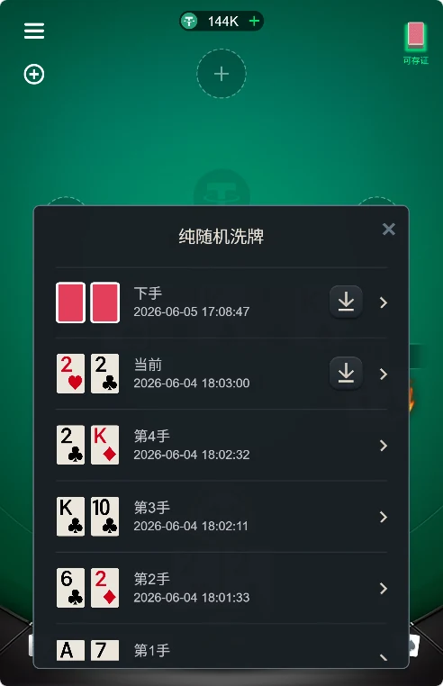
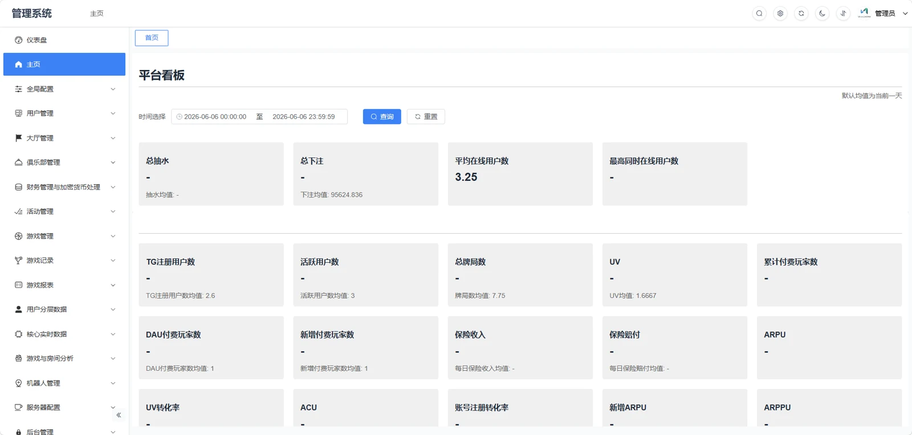

[简体中文](README.md) | [繁體中文](README.zh-TW.md) | [English](README.en.md)

# 德州撲克原始碼與永旺德州專案資料｜AKpoker、KKpoker 選型參考

本倉庫公開展示德州撲克專案的部分用戶端、後端模組與實際產品截圖，可用於評估 Cocos/JavaScript 用戶端、Lua 後端、長牌、短牌、俱樂部、房間、保險與牌局紀錄。倉庫名稱及原始截圖涉及 AKpoker、KKpoker 與永旺德州原始碼。

[圖文產品頁](https://masterai-top.github.io/Texas-Hold-em-Source-Code_AKpoker-Source-Code/zh-tw/) · [程式碼導覽與交付確認](PROJECT_GUIDE.zh-tw.md) · [LICENSE](LICENSE)

## 專案簡介

從大廳到牌桌，看懂德州專案的每個環節。

### 搜尋關鍵字與公開內容的關係

| 搜尋詞 | 本倉庫可核對內容 | 範圍說明 |
| --- | --- | --- |
| AKpoker原始碼 | 倉庫名稱、德州撲克用戶端與後端模組 | 非 AKpoker 官方原始碼聲明 |
| KKpoker原始碼 | 原始產品截圖中可見 KKPOKER 標誌 | 截圖不能證明品牌授權或官方原始碼 |
| 永旺德州原始碼 | 大廳截圖可見「永旺德州」，並有長牌、短牌、俱樂部與保險介面 | 以公開目錄與完整交付驗收為準 |
| H5德州 | JavaScript 用戶端結構可供技術選型參考 |  H5 可直接執行 |

[AKpoker / KKpoker 關係說明](docs/zh-tw/akpoker-kkpoker-source-code.html) · [永旺德州專案資料](docs/zh-tw/yongwang-texas-holdem-source-code.html) · [H5 德州技術比較](docs/zh-tw/h5-texas-holdem-comparison.html) · [短牌程式碼入口](docs/zh-tw/short-deck-poker-source-code.html)

### 長牌與短牌入口

大廳截圖呈現長牌、短牌分類；公開用戶端包含 shortTexas 場景、協定與控制器，可從短牌模組開始閱讀。

### 俱樂部與牌局紀錄

從房間清單、俱樂部入口到牌局紀錄模組，了解選桌與管理流程。

### 保險與歷史介面

透過原始截圖評估保險資訊及歷史紀錄的呈現；規則與計算邏輯仍需搭配完整交付驗證。

## 實際產品畫面，讓需求討論更具體

截圖取自本倉庫 Screencut，保留原始介面及標誌。網頁說明提供三種語言，截圖仍為原始中文，不表示用戶端已完成三語在地化。

### 大廳與玩法入口

長牌、短牌及俱樂部導覽，呈現產品的資訊層級。

### 德州牌桌

座位、公共牌區與操作按鈕，展示行動端牌桌配置。

### 房間介面

對照實際畫面，規劃選桌及入桌體驗。

### 保險介面

觀察保險相關資訊在牌局中的位置。

### 歷史保險

查看歷史紀錄頁，評估查閱資訊的體驗。

### 牌局資訊展示

原檔名為「可存证牌界面」；截圖並非公平性或存證效力的證明。

### 管理後台

畫面包含使用者、俱樂部及報表等選單；不代表對應後台原始碼已公開。

## 技術與公開目錄

目前倉庫展示程式碼與產品資料，不能據此承諾一鍵部署。可確認的公開檔案為 Cocos 風格 JavaScript 用戶端與 Lua 後端模組；原 README 提及的 C++ 核心、Vue 3 / Go 後台及完整資料庫部署文件，需另外核對。

| Path | Module |
| --- | --- |
| [前端/Script/shortTexas](前端/Script/shortTexas) | Cocos / JavaScript |
| [后端/main.lua](后端/main.lua) | Lua |
| [后端/Club](后端/Club) | Club |
| [Screencut](Screencut) | 查看產品截圖 |

[程式碼導覽與交付確認](PROJECT_GUIDE.zh-tw.md)

## 用具體清單確認開發與交付

- **01 · 看產品**：瀏覽大廳、牌桌與後台截圖，確認保留及客製的流程。
- **02 · 看程式碼**：核對用戶端及後端模組、相依項目、引擎版本與缺少的檔案。
- **03 · 驗證交付**：確認可執行展示、建置說明、資料庫腳本、授權範圍與功能驗收紀錄。

## 選型與品牌搜尋常見問題

### 搜尋 AKpoker、KKpoker 原始碼，為何會看到此專案？

倉庫名稱包含 AKpoker，原始截圖中出現 KKPOKER 標誌。本倉庫是 AKpoker 或 KKpoker 官方原始碼

### 永旺德州有哪些可查看的產品資料？

本倉庫大廳截圖可見「永旺德州」名稱，並提供長牌、短牌入口、牌桌、保險與管理後台圖片。可用於評估產品流程，但截圖本身不證明品牌權屬、線上版本一致性或完整程式碼交付範圍。

### 是否提供奧馬哈、AOF、MTT 及 SNG？

原 README 提及這些玩法，但目前公開檔案不足以驗證其完整可用性。需要這些功能時，請確認對應展示與交付清單。

### 公開程式碼與客製服務如何授權？

目前 LICENSE 包含 MIT 授權文字。公開程式碼以該檔案及權利範圍為準；未公開專案、美術、品牌素材及客製服務需另行確認。

## 聯絡維護者

- Telegram: [@xuzongbin001](https://t.me/xuzongbin001)
- Email: [masterai918@gmail.com](mailto:masterai918@gmail.com)

[简体中文](README.md) | [繁體中文](README.zh-TW.md) | [English](README.en.md)
